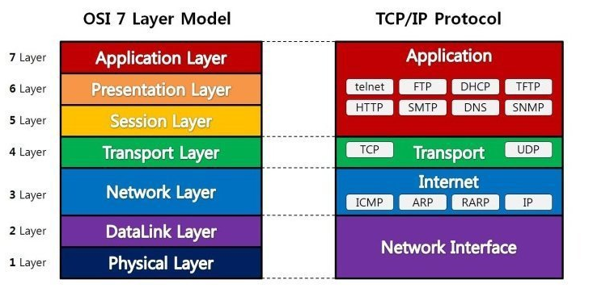

# OSI 7 Layer

OSI 7계층은 네트워크를 구성하는 표준 계층 중 하나다.

각 계층을 분리하여 역할을 나누었다.

하위계층+현계층은 상위계층에 정보를 제공한다.

**(Layer 7,6,5,4) Application + Transport : 컴퓨터네트워크**

**(Layer 3,2,1) Internet + Network Interface : 데이터통신**

1. 물리 계층
    > 하드웨어 전송 기술! 비트 신호 (0, 1) 통신!  
    데이터의 종류 or 에러를 제어하지 X  
    (관련 장비 : 통신케이블, 허브, 리피터)

2.  데이터 링크 계층
    > 같은네트워크에 있는 것끼리의 통신! 이웃 노드간 데이터 전송 담당 
    └> 헤더 덧붙임 => 데이터단위 시작 표시 & 목적지 주소 
    에러 제어 필요 O  
    └> 트레일러 덧붙임 => 에러검출코드  
    전송 단위 : Frame
    (관련 장비 : 스위치, 브릿지)
3. 네트워크 계층
    > 같은네트워크에 있는 것끼리의 통신! 
    └> 헤더 => 발신지, 목적지의 논리주소 
    IP주소 제공 
    (관련 장비 : 라우터, 스위치) 
     
    └> 라우팅해가는 주소를 관찰해보면, ip주소(네트워크주소)는 변하지 않는다. 전체네트워크에서 나를 구별해주는 주소가 바뀌면 안되니까. 그런데 물리주소는 계속 변함. 내 데이터를 잘 보내줄 수 있는 애를 찾아서 계속 나아가는 것임!

4. 전송 계층 
    > TCP, UDP (프로토콜)이 있는 계층! 
    양 끝단(End to End)간 데이터 transfer! 
    *(참고)  layer 2 에서 분명히 수행했던 "흐름제어 & 오류제어"를 layer 4에서 또 함. 왜 하위계층에서 했던걸 또해? layer 3에서 loss가 발생했을 가능성이 있기 때문이라 함.  그런데 layer 3에서 "흐름제어 & 오류제어"하기엔 복잡해서 layer 4 에서 해준다고 말씀하심.*  
    전송 단위 : Segment

5. 세션 계층
    > 양 끝단의 응용 프로세스가 통신을 관리하기 위한 방법 제공! 
    (대표적 : Socket) 

6. 표현 계층
    > 데이터 압축, 형식변환, 암복호화, 보안 
    송수신자가 공통으로 이해하도록 데이터 표현형식을 바꿈 

7. 응용 계층
    > 우리가 접하는 일반적인 응용프로그램 수행 
    HTTP, FTP 등 프로토콜이 속함
